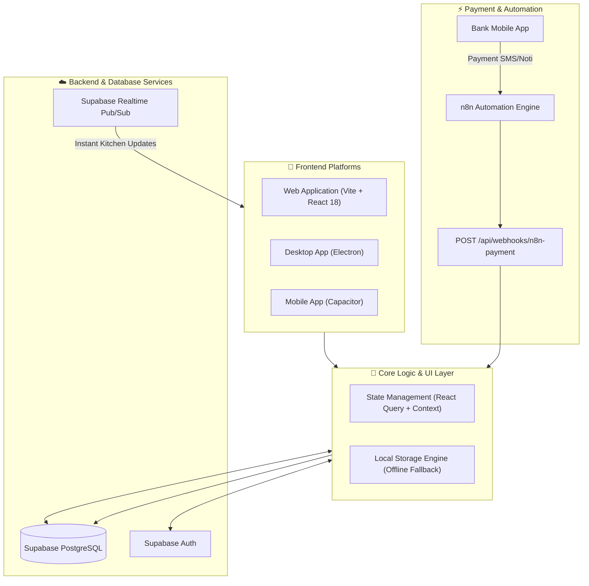

# 🍹 Momoka POS - Cross-Platform F&B Point of Sale System

<div align="center">


**Hệ thống quản lý bán hàng và vận hành F&B đa nền tảng (Web, Desktop App, Mobile App)**  
Tích hợp tự động hóa thanh toán Ngân hàng qua **n8n Webhook** & Cơ chế **Offline Fallback** linh hoạt.

[Tính Năng](#-tính-năng-nổi-bật) • [Sơ Đồ Kiến Trúc](#-sơ-đồ-kiến-trúc-hệ-thống) • [Hướng Dẫn Cài Đặt](#-hướng-dẫn-cài-đặt) • [Tài Liệu Dự Án](#-tài-liệu-dự-án)

</div>

---

## 🚀 Tính Năng Nổi Bật

### 🛒 1. Màn Hình POS Bán Hàng (Point of Sale Interface)
- **Tối ưu thao tác nhanh:** Giao diện trực quan chọn danh mục, món ăn, tùy chọn (Topping, Đường/Đá, Variant).
- **Thanh toán đa hình thức:** Tiền mặt, Chuyển khoản QR ngân hàng, Tích điểm thành viên.
- **Tính toán hóa đơn tự động:** Hỗ trợ áp mã giảm giá (Promotion Discount), tính tiền thừa, in hóa đơn/phiếu bếp.

### 🍳 2. Màn Hình Bếp Theo Thời Gian Thực (Realtime Kitchen Display System - KDS)
- Cập nhật đơn hàng mới tức thì qua **Supabase Realtime**.
- Phân loại trạng thái chuẩn F&B: `Chờ làm (New)` ➔ `Đang làm (Preparing)` ➔ `Hoàn thành (Completed)`.
- Bộ đếm thời gian chế biến cho từng đơn hàng giúp bếp chủ động ưu tiên.

### 📦 3. Quản Lý Kho & Định Lượng Nguyên Liệu (Inventory & Recipe Management)
- Theo dõi tồn kho nguyên liệu chi tiết (Đường, Sữa, Trà, Cốc,...).
- Khai báo công thức (Recipe/BOM) cho từng món ăn/đồ uống.
- Tự động trừ tồn kho nguyên liệu khi đơn hàng được hoàn tất.

### 📊 4. Báo Cáo Doanh Thu & Thu Chi (Reports & Cashbook)
- Biểu đồ doanh thu trực quan theo ngày/tuần/tháng dùng **Recharts**.
- Sổ quỹ thu chi (Cashbook) ghi nhận dòng tiền thực tế tại cửa hàng.
- Báo cáo món bán chạy (Top Sellers) và thống kê tỷ trọng thanh toán.

### ⚡ 5. Tự Động Hóa Đối Chiếu Thanh Toán Qua n8n Webhook
- Tự động nhận webhook chuyển khoản từ ứng dụng ngân hàng thông qua workflow **n8n**.
- Chuẩn hóa mã đơn hàng (`#88854860`), tự động đối chiếu số tiền giao dịch và chuyển trạng thái đơn sang `PAID` mà không cần nhân viên xác nhận thủ công.

### 🌐 6. Đa Nền Tảng (Cross-Platform Ready)
- **Web App:** Chạy mượt mà trên mọi trình duyệt web hiện đại.
- **Desktop App:** Đóng gói ứng dụng chạy Windows qua **Electron**.
- **Mobile App:** Hỗ trợ cài đặt trên Android/iOS qua **Capacitor**.
- **Offline Fallback:** Tự động chuyển sang dữ liệu nội bộ nếu không có kết nối Database, đảm bảo cửa hàng không bị gián đoạn vận hành.

---

## 📐 Sơ Đồ Kiến Trúc Hệ Thống



---

## 🛠️ Công Nghệ Sử Dụng

| Tầng | Công Nghệ / Thư Viện |
|---|---|
| **Frontend Framework** | React 18, TypeScript, Vite |
| **Styling & UI Components** | TailwindCSS, shadcn/ui, Radix UI, Lucide Icons |
| **State & Data Fetching** | TanStack React Query v5 |
| **Visual Charts** | Recharts |
| **Backend & Realtime DB** | Supabase (PostgreSQL, Row Level Security, Realtime) |
| **Automation Workflow** | n8n Webhooks |
| **Cross-Platform Container** | Electron v42, Capacitor v8 |
| **Testing & Quality** | Vitest, ESLint, TypeScript Compiler |

---

## 💻 Hướng Dẫn Cài Đặt

### 1. Yêu cầu môi trường
- **Node.js** `>= 18.0.0`
- **npm** `>= 9.0.0`

### 2. Cài đặt các gói phụ thuộc
```bash
git clone https://github.com/luongnguyen1088/pos.git
cd pos
npm install
```

### 3. Cấu hình biến môi trường
Tạo file `.env` từ `.env.example`:
```bash
cp .env.example .env
```
Điền thông tin kết nối Supabase của bạn:
```env
VITE_SUPABASE_URL=https://your-project-ref.supabase.co
VITE_SUPABASE_ANON_KEY=your-anon-key
SUPABASE_URL=https://your-project-ref.supabase.co
SUPABASE_SERVICE_ROLE_KEY=your-service-role-key
N8N_WEBHOOK_SECRET=your-shared-secret
```

### 4. Thiết lập Database (Supabase)
1. Mở **SQL Editor** trong bảng điều khiển Supabase của bạn.
2. Chạy toàn bộ script trong file [`supabase/schema.sql`](file:///C:/Users/ADMIN/.gemini/antigravity-ide/scratch/pos/supabase/schema.sql) để khởi tạo các bảng `anvat_categories`, `anvat_products`, `anvat_orders`, `anvat_ingredients`,... và kích hoạt Realtime Publication.

### 5. Khởi chạy ứng dụng

```bash
# Khởi chạy bản Web (Dev Mode)
npm run dev

# Khởi chạy bản Desktop (Electron Dev Mode)
npm run electron:dev

# Chạy Unit Tests
npm run test

# Build bản Production
npm run build
```

---

## 📡 Webhook n8n Thanh Toán

- **Endpoint:** `POST /api/webhooks/n8n-payment`
- **Header xác thực:** `x-webhook-secret: <N8N_WEBHOOK_SECRET>`
- **Payload hỗ trợ (JSON Array hoặc Object):**
```json
[
  {
    "transactionAmount": 22000,
    "order": "88854860"
  }
]
```

---

## 📂 Tài Liệu Dự Án Chi Tiết

Tài liệu thiết kế nghiệp vụ và kế hoạch phát triển mở rộng được lưu trữ trong thư mục [`docs/`](file:///C:/Users/ADMIN/.gemini/antigravity-ide/scratch/pos/docs/):
- [`docs/DE_XUAT_PHAT_TRIEN_MOKA.md`](file:///C:/Users/ADMIN/.gemini/antigravity-ide/scratch/pos/docs/DE_XUAT_PHAT_TRIEN_MOKA.md): Đề xuất lộ trình phát triển và nâng cấp hệ thống.
- [`docs/BAO_GIA_HE_THONG_MOKA.md`](file:///C:/Users/ADMIN/.gemini/antigravity-ide/scratch/pos/docs/BAO_GIA_HE_THONG_MOKA.md): Báo giá kiến trúc và kỹ thuật hệ thống.
- [`docs/BANG_GIA_THUE_BAO_SAAS_MOKA.md`](file:///C:/Users/ADMIN/.gemini/antigravity-ide/scratch/pos/docs/BANG_GIA_THUE_BAO_SAAS_MOKA.md): Mô hình gói thuê bao SaaS cho chuỗi cửa hàng.

---

## 📝 License & Author

- **Tác giả:** Lương Nguyễn ([luongnguyen1088](https://github.com/luongnguyen1088))
- **Dự án:** Portfolio POS System for Job Application
