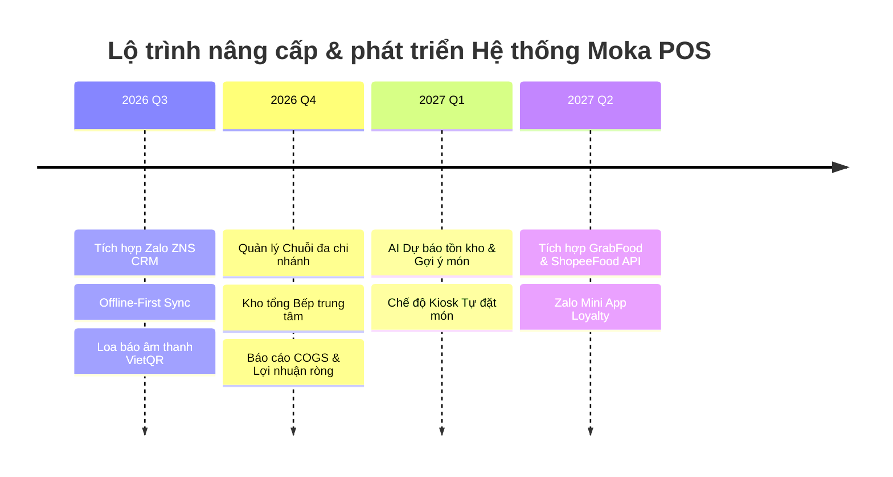

# ĐỀ XUẤT Ý TƯỞNG PHÁT TRIỂN & NÂNG CẤP HỆ THỐNG MOKA POS

**Dự án:** Hệ thống Quản lý Bán hàng & Đặt hàng Moka (Momoka POS)  
**Tác giả đề xuất:** Đội ngũ Kiến trúc sư Phần mềm & Sản phẩm  
**Ngày lập:** 22/07/2026  

---

## 🎯 ĐỊNH HƯỚNG CHIẾN LƯỢC

Moka POS đã sở hữu nền tảng vững chắc với kiến trúc **Đa nền tảng (Web, Windows, Android)**, **Đồng bộ Realtime (Supabase)**, **Tự động hóa chuyển khoản VietQR (n8n Webhook)**, **Màn hình Bếp (KDS)** và **Quản lý Kho định lượng (BOM)**.

Để tạo ra lợi thế cạnh tranh vượt trội so với các giải pháp truyền thống (như KiotViet, iPOS, CukCuk) và tăng doanh thu cho chủ cửa hàng, hệ thống Moka POS được đề xuất định hướng phát triển theo **5 Trụ cột Chiến lược**:

```
+-----------------------------------------------------------------------+
|                    5 TRỤ CỘT PHÁT TRIỂN MOKA POS                       |
+-------------------+-------------------+-------------------+-----------+
| 1. AI & Smart     | 2. Chuỗi & Kho    | 3. Marketing &    | 4. IoT &  |
|    Automation     |    Trung Tâm      |    Zalo OA CRM    |    Omni   |
+-------------------+-------------------+-------------------+-----------+
                    | 5. Tài Chính & Báo Cáo COGS Nâng Cao |
                    +--------------------------------------+
```

---

## I. TRỤ CỘT 1: ỨNG DỤNG AI & TỰ ĐỘNG HÓA THÔNG MINH (AI & SMART AUTOMATION)

### 1.1. AI Dự Báo Nguyên Liệu & Tồn Kho (AI Inventory & Demand Forecasting)
- **Vấn đề giải quyết**: Tránh tình trạng quán bị thiếu nguyên liệu vào ngày đông khách hoặc nguyên liệu tươi bị hỏng/hết hạn do nhập quá nhiều.
- **Giải pháp**: AI phân tích lịch sử bán hàng theo ca, theo ngày trong tuần, yếu tố thời tiết và ngày lễ để:
  - Dự báo chính xác số lượng nguyên liệu (sữa, trà, trân châu, trái cây...) cần dùng cho 3 - 7 ngày tới.
  - Tự động tạo **Đơn gợi ý nhập kho** gửi cho chủ quán duyệt chỉ với 1-click.

### 1.2. AI Upsell / Cross-sell Gợi Ý Món Thông Minh trên QR Order
- **Vấn đề giải quyết**: Tăng giá trị trung bình trên mỗi đơn hàng (AOV - Average Order Value).
- **Giải pháp**: Trên giao diện quét mã QR đặt món của khách:
  - AI phân tích món khách vừa chọn để gợi ý món kèm phù hợp (Ví dụ: Khách chọn *Trà sữa* $\rightarrow$ Gợi ý *Topping Trân châu Ô long* hoặc *Bánh ngọt* đi kèm với giá ưu đãi).
  - Gợi ý theo thời tiết realtime (Trời nóng $\rightarrow$ Gợi ý *Trà trái cây mát lạnh*; Trời lạnh/mưa $\rightarrow$ Gợi ý *Trà nóng / Đồ uống ấm*).

### 1.3. AI Assistant Chatbot Chăm Sóc Khách Hàng qua Zalo OA
- Khách hàng có thể tương tác trực tiếp với Zalo Official Account của quán để:
  - Xem Menu, Đặt trước món đến lấy.
  - Tra cứu điểm tích lũy & thăng hạng thành viên.
  - Nhận hỗ trợ & phản hồi đánh giá chất lượng dịch vụ.

---

## II. TRỤ CỘT 2: QUẢN LÝ CHUỖI CỬA HÀNG & BẾP TRUNG TÂM (MULTI-STORE & CENTRAL KITCHEN)

### 2.1. Quản lý Đa Chi Nhánh (Multi-Branch Management)
- **Quản lý tập trung**: Cho phép chủ chuỗi quản lý 5 - 50 chi nhánh trên cùng 1 tài khoản Admin.
- **Phân quyền nâng cao**: Phân quyền chi tiết theo vai trò (Quản lý vùng, Quản lý cửa hàng, Thu ngân, Nhân viên pha chế).
- **So sánh hiệu năng chi nhánh**: Báo cáo so sánh doanh thu, chi phí, công suất bán hàng và món hot của từng chi nhánh theo thời gian thực.

### 2.2. Kho Tổng & Bếp Trung Tâm (Central Kitchen & Warehouse Transfer)
- Quản lý kho tổng trung tâm chuyên sơ chế & phân phối nguyên vật liệu cho các chi nhánh con.
- Đặt hàng nội bộ (Internal Order): Chi nhánh tạo yêu cầu cấp nguyên liệu $\rightarrow$ Bếp trung tâm duyệt & điều chuyển kho tự động.

### 2.3. Chế Độ Offline-First Tuyệt Đối (Offline Resilient POS)
- Nâng cấp khả năng bán hàng khi mất kết nối Internet:
  - Khi mất mạng, POS tự động chuyển sang chế độ **Local Storage / IndexedDB**, mọi thao tác bán hàng, in hóa đơn, in bếp vẫn diễn ra mượt mà 100%.
  - Khi có mạng trở lại, hệ thống tự động đồng bộ ngầm (Background Sync) về Supabase Cloud mà không gián đoạn thao tác của thu ngân.

---

## III. TRỤ CỘT 3: MARKETING TỰ ĐỘNG & LỰA CHỌN KHÁCH HÀNG (AUTOMATED CRM & MARKETING)

### 3.1. Tích hợp Zalo ZNS & SMS Automation
- **Tự động gửi tin nhắn chăm sóc qua Zalo**:
  - Gửi tin nhắn **Cảm ơn & Tích điểm** ngay sau khi đơn hàng hoàn thành.
  - Gửi **Voucher sinh nhật** tự động trước 3 ngày.
  - **Khôi phục khách hàng cũ**: Gửi tin nhắn tặng ưu đãi cho khách đã quá 30 ngày chưa quay lại quán.

### 3.2. Thẻ Thành Viên Điện Tử & Gamification (Zalo Mini App / Apple Wallet)
- Khách hàng không cần tải app riêng, chỉ cần lưu **Thẻ thành viên điện tử** vào Zalo Mini App hoặc Apple/Google Wallet.
- **Vòng quay may mắn (Lucky Wheel)**: Cho phép khách quay thưởng nhận voucher sau mỗi hóa đơn từ 100.000đ.

---

## IV. TRỤ CỘT 4: OMNICHANNEL & TÍCH HỢP THIẾT BỊ IOT (HARDWARE & APIS)

### 4.1. Đồng Bộ Đơn Hàng Từ Các Sàn Giao Hàng (GrabFood, ShopeeFood, Baemin)
- **Vấn đề**: Hiện tại các quán phải dùng 3 - 4 máy POS của từng sàn khác nhau, nhân viên phải nhập tay lại đơn vào POS chính.
- **Giải pháp**: Tích hợp API hợp nhất đơn hàng từ ShopeeFood & GrabFood về thẳng hệ thống Moka POS và tự động đẩy xuống màn hình Bếp.

### 4.2. Kiosk Tự Đặt Món (Self-Service Kiosk UI)
- Thêm chế độ giao diện **Kiosk màn hình cảm ứng đứng** tại cửa hàng.
- Khách tự chọn món, tự quét VietQR thanh toán và nhận số thứ tự lấy đồ, giảm 50% áp lực cho thu ngân giờ cao điểm.

### 4.3. Tích Hợp Thiết Bị IoT & Thông Báo Âm Thanh (Smart Hardware Integration)
- **Loa báo tiền về (VietQR Audio Speaker)**: Phát âm thanh tức thì khi Webhook gạch nợ thành công (*"Moka POS: Đã nhận 45.000 đồng từ VietQR"*).
- **Tự động bật Két tiền (Cash Drawer Trigger)**: Tự động phát xung điện mở két tiền mặt khi thu ngân bấm thanh toán.
- **Tích hợp Cân điện tử RS232/USB**: Dùng cho các quán bán đồ ăn theo trọng lượng (ví dụ: hoa quả, topping tính theo gram).

---

## V. TRỤ CỘT 5: BÁO CÁO TÀI CHÍNH CHUYÊN SÂU & LỢI NHUẬN THỰC TẾ (REAL P&L & COGS)

### 5.1. Báo Cáo Giá Vốn Hàng Bán (COGS - Cost of Goods Sold)
- Tính toán chính xác giá vốn từng ly nước/món ăn theo phương pháp **Giá bình quân gia quyền** hoặc **FIFO** dựa trên lịch sử phiếu nhập kho.
- Hiển thị **Biên lợi nhuận gộp (%)** từng món: Giúp chủ quán biết chính xác món nào mang lại lời nhiều nhất để tập trung đẩy mạnh bán.

### 5.2. Báo Cáo Lợi Nhuận Ròng (Real P&L Statement)
- Tự động kết hợp: **Doanh thu bán hàng** - **Giá vốn nguyên liệu (COGS)** - **Chi phí vận hành (Sổ quỹ Thu Chi: Tiền điện, nước, mặt bằng, lương nhân viên)** = **Lợi nhuận ròng thực tế (Net Profit)**.

---

## 🗓️ LỘ TRÌNH ĐỀ XUẤT PHÁT TRIỂN (ROADMAP 2026 - 2027)



---

## 💡 TỔNG KẾT & KHUYẾN NGHỊ TÍNH NĂNG ƯU TIÊN LÀM NGAY (QUICK WINS)

Để tạo ra giá trị tức thì cho khách hàng sử dụng Moka POS, đội ngũ đề xuất triển khai trước 3 tính năng **Quick Wins** trong 2 - 4 tuần tới:

1. ⚡ **Loa thông báo âm thanh VietQR**: Tích hợp Web Audio API / Loa đọc tiền về tự động.
2. 📱 **Tích hợp Zalo ZNS tự động tích điểm & cảm ơn**: Tăng tỉ lệ khách quay lại quán.
3. 📊 **Báo cáo Giá vốn COGS & Tỷ lệ lợi nhuận gộp từng món**: Giúp chủ quán tối ưu menu.
